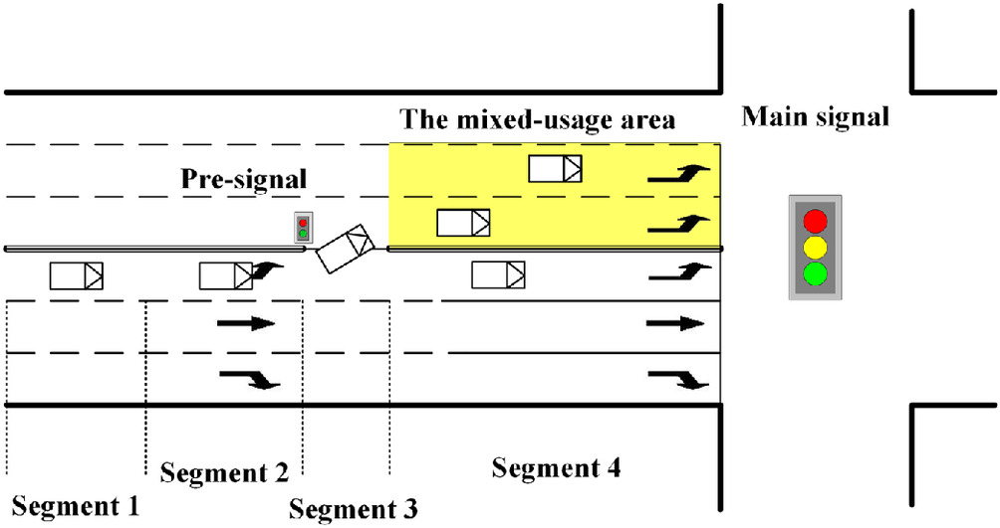

Abstract：This study aimed to describe the operation of left-turn vehicles under the impact of exit lanes for left-turn (EFL) control. A microscopic traffic flow model was proposed, in which a multivariate logit model and a lane-change model were combined in the car-following model for lane selection and lane changing, respectively. The results of the plausibility validation showed that the model can describe car-following behavior in different road segments, lane selection behavior between normal left-turn lanes and lanes in the mixed-usage area, and the double stop-and-go phenomenon due to the existence of presignal control. The impacts of geometrical, traffic, and driver-proficiency conditions on vehicular delays, lane usage, and variance of velocity were explored. Effectiveness in improving running efficiency increases when drivers have higher proficiency in EFL.

